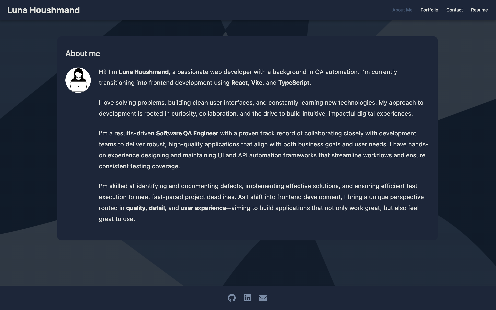
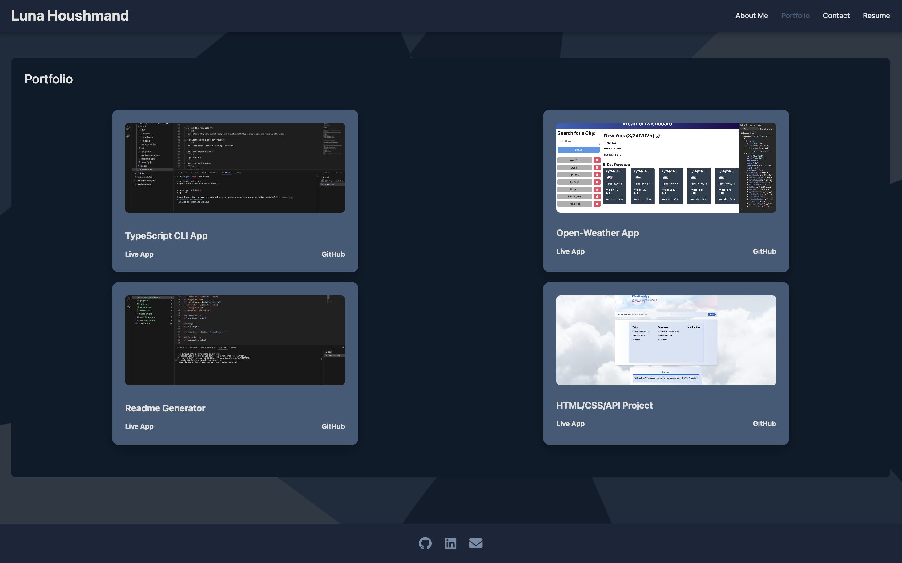
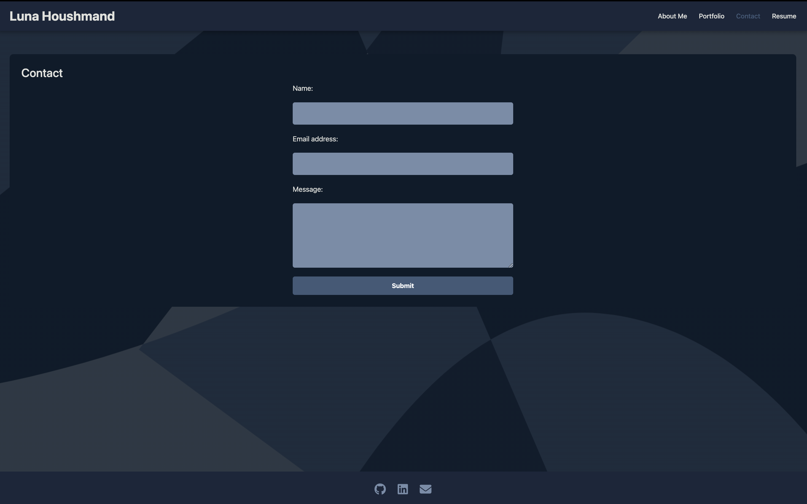

# My-React-Portfolio

## Description

A personal portfolio web application built with React and Vite. It showcases selected frontend and CLI projects, along with a contact form and resume download feature. The design uses a clean modern UI with an abstract background and a dark color palette.

- **Motivation:** To build a professional portfolio showcasing projects and skills while practicing frontend development.
- **Purpose:** To demonstrate proficiency in React, Vite, and modern web styling for job-seeking and self-branding.
- **Problem Solved:** Consolidates key projects and contact methods into one professional landing page.
- **What I Learned:** React components, CSS layout with custom design systems, Vite tooling, Netlify deployment, and responsive design strategies.

## Table of Contents

- [Installation](#installation)
- [Usage](#usage)
- [Credits](#credits)
- [License](#license)
- [Badges](#badges)
- [Features](#features)
- [How to Contribute](#how-to-contribute)
- [Tests](#tests)
- [Netlify Link](#netlify-link)

## Installation

1. Clone the repository:
   ```sh
   git clone https://github.com/lunahoushmand16/OpenWeather-API-App
   ```
2. Navigate to the project folder:
   ```sh
   cd OpenWeather-API-App
   ```
3. Install dependencies:
   ```sh
   npm install
   ```
4. Run the application:
   ```sh
   npm run start
   ```

## Usage

- View the About Me section for Luna’s background and transition into frontend development.
- Explore the Portfolio page to see highlighted projects.
- Use the Contact page to send a message (saved in localStorage).
- Download Luna's resume from the Resume page.


### Screenshots:






## Credits

- Created by **[Luna Houshmans](https://github.com/lunahoushmand16)**
- Built with [JavaScript XML, React](https://legacy.reactjs.org/docs/introducing-jsx.html)
- Deployed with [Netlify](https://www.netlify.com/)
- [Markdown help via](https://docs.github.com/en/get-started/writing-on-github/getting-started-with-writing-and-formatting-on-github/basic-writing-and-formatting-syntax)

## License

This project is licensed under the **MIT License**. See the [LICENSE](LICENSE) file for details.

## Badges


## Features
- React component-based structure
- Custom color palette and background image
- Responsive design (mobile-friendly)
- LocalStorage-based contact form
- Resume PDF download
- Live deployed on Netlify

## How to Contribute

1. Fork the repository
2. Create a new branch: `git checkout -b feature-name`
3. Make changes and commit: `git commit -m 'Added new feature'`
4. Push changes: `git push origin feature-name`
5. Open a pull request

## Tests

1. Open the Netlify deployment link
2. About page displays bio and avatar
3. Portfolio page shows 4 projects with images and links
4. Contact page includes a working form
5. Resume page allows downloading Luna’s resume as a PDF

## Netlify Link

[Netlify Live App](https://myreactportfolionetlify.netlify.app/)
